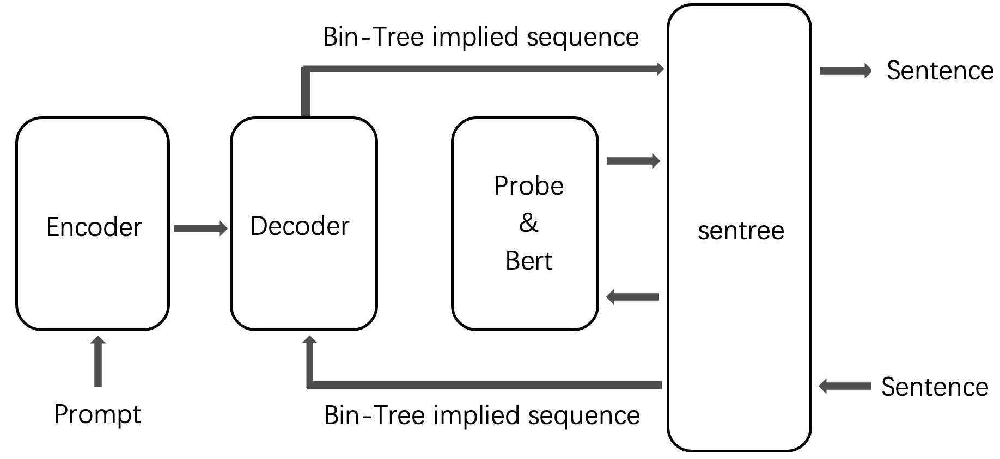

# SenTree
A module that can convert natural language sentence into binary tree implied sequence, is based on and leveraging the Structural-Probe: https://github.com/john-hewitt/structural-probes

The module is easily integrated into existing LLMs based on Transformers by using the binary tree implied sequence as the input and output of the decoder.
The module also supports converting binary tree implied sequences to natural language sentences and letting the output be easily converted back to readable sentences.

## Requisitions

1. It is recommended to construct a virtual environment for this project. Only python3 is supported.
2. Download and install the Structural-Probe project, references: [Installing & Getting Started of Structural-Probe](https://github.com/john-hewitt/structural-probes?tab=readme-ov-file#installing--getting-started).
3. Configurate your system environment variables for Python to import the modules.
4. Clone this repository.
5. Edit the configuration file `probe.yaml` of this project, especially the absolute path of `depth_params_path`

## Getting Started
Run `demo.py` and `sentree_util.py` to get started.

The `sentree_util.py` can do the conversions between sentences and binary tree implied sequences based on your option and input.
It will be a handy tool during the process of integrating SenTree to existing systems.

## Integrating

The module is proposed to be used to convert the raw sentence into binary tree implied sequence for decoder.
The training processes of autoregressive models stay the same with the original processes of them.
The autoregressive process of generating will be altered so that it is no longer a word after a word style, but the latest generated word may be inserted at some position in the being generated sentence that is not completed yet.

The SenTree module should be integrated into autoregressive models as illustrated below:

  

